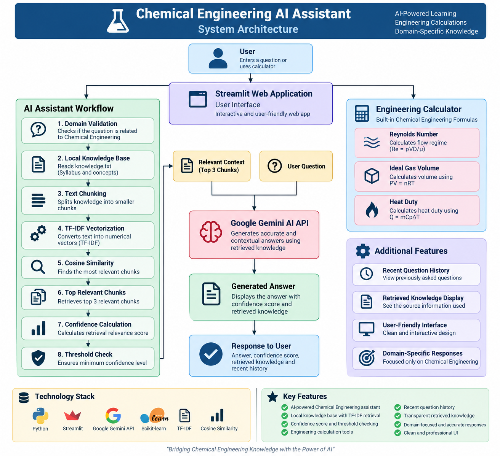

# 🧪 Chemical Engineering AI Assistant

An AI-powered Chemical Engineering application built using **Python, Streamlit, Scikit-learn, and Google Gemini AI**.

The application helps users ask Chemical Engineering questions and receive AI-generated answers supported by relevant information retrieved from a local knowledge base.

---

## 🚀 Features

### 🤖 AI-Powered Assistant

- Answers Chemical Engineering-related questions
- Performs Chemical Engineering domain validation
- Retrieves relevant information from a local knowledge base
- Uses Google Gemini AI to generate structured answers
- Displays recently asked questions

### 📚 Local Knowledge Retrieval

The application uses a local retrieval system to find relevant information before generating an AI response.

The retrieval process uses:

- TF-IDF Vectorization
- Cosine Similarity
- Top relevant knowledge chunks
- Retrieval confidence indicator

### 🧮 Chemical Engineering Calculator

The application includes three calculation tools:

- Reynolds Number
- Ideal Gas Volume
- Heat Duty

---

## 🏗️ System Architecture



### Application Workflow

```text
User
  │
  ▼
Streamlit Application
  │
  ├───────────────┐
  ▼               ▼
AI Assistant   Engineering Calculator
  │               │
  │               ├── Reynolds Number
  │               ├── Ideal Gas Volume
  │               └── Heat Duty
  │
  ▼
Domain Validation
  │
  ▼
Local Knowledge Base
  │
  ▼
TF-IDF Vectorization
  │
  ▼
Cosine Similarity
  │
  ▼
Relevant Knowledge Retrieval
  │
  ▼
Google Gemini AI
  │
  ▼
Generated Answer
⚙️ Technology Stack
Python
Streamlit
Google Gemini API
Scikit-learn
TF-IDF Vectorization
Cosine Similarity
📂 Project Structure
chemical-ai-assistant/
│
├── streamlit_app.py
├── knowledge.txt
├── requirements.txt
├── README.md
│
└── assets/
    └── architecture_diagram.png
💻 Installation

Clone the repository:

git clone <your-repository-url>

Move into the project folder:

cd chemical-ai-assistant

Create a virtual environment:

python -m venv venv

Activate the environment on Windows:

venv\Scripts\activate

Install the required packages:

pip install -r requirements.txt

Run the application:

streamlit run streamlit_app.py
🧠 Key Technical Learning

During the development of this project, cloud-based embeddings initially caused API quota limitations.

To improve reliability, the knowledge retrieval system was redesigned using:

Local Knowledge Base → TF-IDF → Cosine Similarity → Relevant Context

This removed the dependency on embedding API quotas for the retrieval process while Gemini AI is used for generating the final response.

🔮 Future Improvements
Larger Chemical Engineering knowledge base
PDF document support
Advanced semantic search
Conversational memory
Cloud deployment
👩‍💻 Author

Aarthi

Chemical Engineering | Artificial Intelligence Project